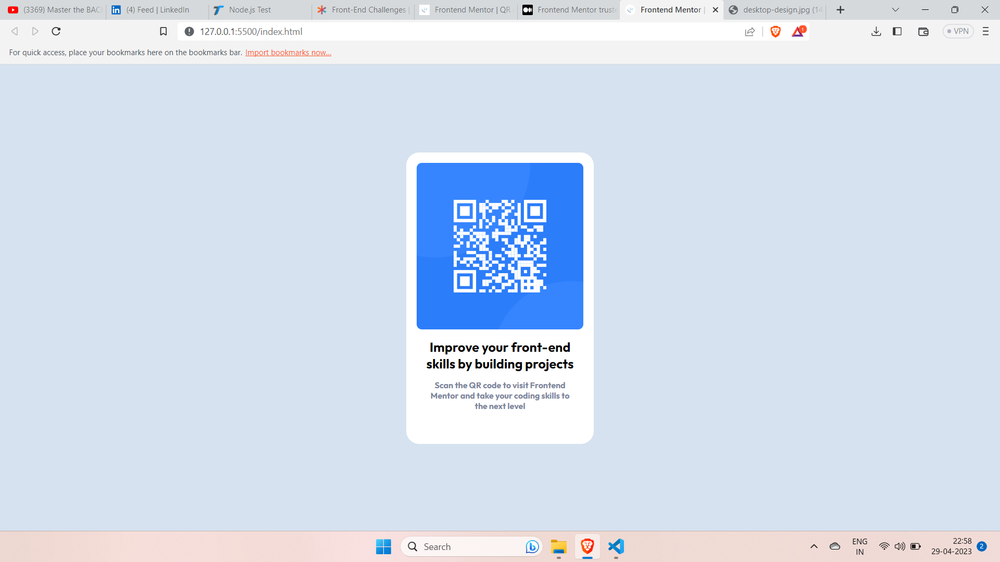
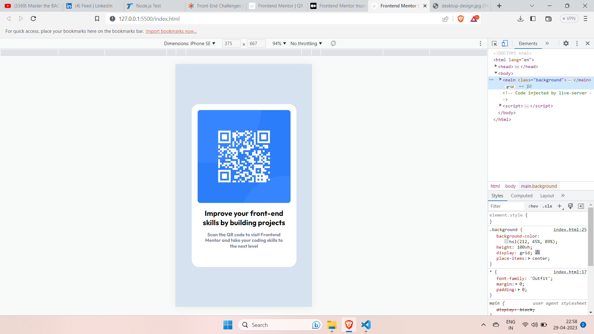

# Frontend Mentor - QR code component solution

This is a solution to the [QR code component challenge on Frontend Mentor](https://www.frontendmentor.io/challenges/qr-code-component-iux_sIO_H). Frontend Mentor challenges help you improve your coding skills by building realistic projects. 

## Table of contents

- [Overview](#overview)
  - [Screenshot](#screenshot)
  - [Links](#links)
- [My process](#my-process)
  - [Built with](#built-with)
  - [What I learned](#what-i-learned)
- [Author]( #Author)
- [Acknowledgments](#acknowledgments)

**Note: Delete this note and update the table of contents based on what sections you keep.**

## Overview

### Screenshot





### Links

- Live Site URL: [https://qr-code-component-t2ab.onrender.com/](https://qr-code-component-t2ab.onrender.com/)

## My process

### Built with

- Semantic HTML5 markup
- CSS custom properties
- CSS Grid


**Note: These are just examples. Delete this note and replace the list above with your own choices**

### What I learned

Use this section to recap over some of your major learnings while working through this project. Writing these out and providing code samples of areas you want to highlight is a great way to reinforce your own knowledge.

To see how you can add code snippets, see below:

```html
<body>
  <main class="background">
    <div class="card">
      <div class="qrCode">
        
      </div>
      <div class="details">
        <h1>
          Improve your front-end skills by building projects
        </h1>
        <h4>
          Scan the QR code to visit Frontend Mentor and take your coding skills to the next level
        </h4>
      </div>
    </div>
  </main>
</body>
```
```css

     *{
      font-family: 'Outfit';
      margin: 0;
      padding: 0;

     }
    .attribution { font-size: 11px; text-align: center; }
    .attribution a { color: hsl(228, 45%, 44%); }
    .background {
      background-color: hsl(212, 45%, 89%);
      height : 100vh;
      display: grid;
      place-items: center;
    }
    .card{
      background-color: hsl(0, 0%, 100%);
    
      box-sizing: border-box;
      max-width: 18rem;
      height: 28rem;
      padding : 1rem;
      border-radius: 20px;
    }
    .qrCode{
      width: auto;

    }
    .qrCode img {
      width: 100%;
      border-radius: 8px;

    }
    .details{
      text-align: center;
      padding: 11px;
      margin-bottom : 4px;
    }

    h1 {
      font-size: 20px;
      width: 700;
      margin-bottom : 12px;
    }
    h4 {
      font-size: 0.8rem;
      color :hsl(220, 15%, 55%);
      width: 400;
    }

 
```
```js
const proudOfThisFunc = () => {
  console.log('🎉')
}
```


## Author

- Frontend Mentor - [@sayyedaaman2](https://www.frontendmentor.io/profile/sayyedaaman2)
- Twitter - [@SayyedAaman](https://www.twitter.com/SayyedAaman)
- Linkedin - [@sayyed-aaman](https://www.linkedin.com/in/sayyed-aaman/)
